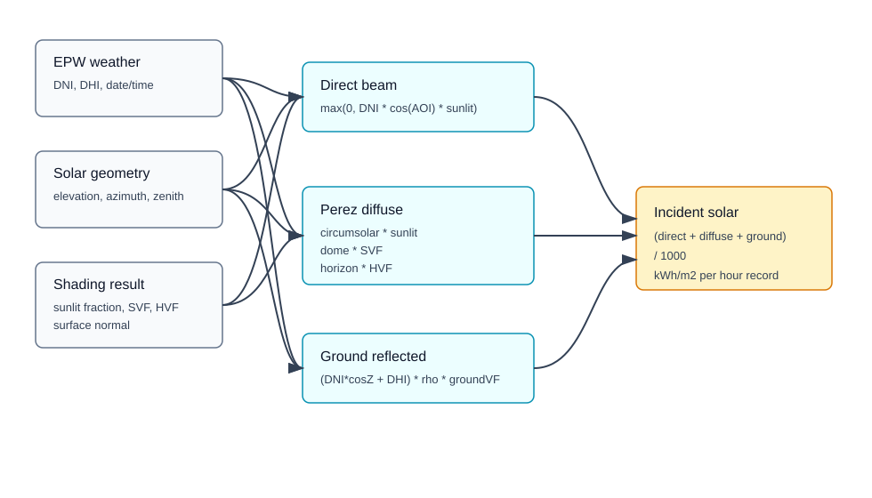

# Incident Radiation From Weather and Shading



This guide explains how the current implementation combines weather-file radiation, solar geometry, surface orientation, sunlit fraction, and diffuse view factors to compute incident solar radiation.

## Related API References

- [Python reference: `voxel_shading`](../python-reference.md#voxel_shading)
- [Web reference: VoxelShading endpoints](../web-api-reference.md#controller-endpoint-inventory)
- Shading API output: `GET /api/voxelShading/result/{jobId}`
- Weather-to-radiation implementation: `Weather.ComputeAnnualIncidentRadiationFromShadingResult`

## Source Implementation

- `EnergyAtlasCore/Weather.cs`
- `EnergyAtlasCore/Model/PerezSky.cs`
- `EnergyAtlasCore/VoxelShading/ShadingResult.cs`

## Inputs

| Input | Source |
| --- | --- |
| `DirectNormalRadiation` (`DNI`) | EPW column parsed in `Weather.cs` from index 14. |
| `DiffuseHorizontalRadiation` (`DHI`) | EPW column parsed in `Weather.cs` from index 15. |
| Solar elevation and azimuth | `SolarGeometry.solarelevation` and `SolarGeometry.solarazimuth`. |
| Surface normal | `ShadingGroupResult.Normal`. |
| Sunlit fraction | `ShadingGroupResult.SunlitFraction`. |
| Sky visibility | `ShadingGroupResult.SkyViewFactor`. |
| Horizon visibility | `ShadingGroupResult.HorizonViewFactor`. |

## Hourly Expansion

`ComputeAnnualIncidentRadiationFromShadingResult` expands a representative-day shading result into all `365 * 24` hours.

1. `repDayCount = ceil(365 / CalcUpdateFreq)`.
2. `stepsPerRepDay = SunlitFraction.Length / repDayCount`.
3. `subStepsPerHour = stepsPerRepDay / 24`.
4. For each annual hour:
   - `dayOfYear = hourIndex / 24`
   - `repDayIndex = dayOfYear / CalcUpdateFreq`
   - if already hourly, read one sunlit value
   - otherwise average sub-hour values inside the hour

## Surface Orientation

The incident radiation calculation converts group normal to the angles expected by `PerezSky`:

- `AltitudeAngleDegrees(normal)` returns tilt from vertical `+Z`.
- `AzimuthAngleDegrees(normal)` projects the normal into XY and returns a rounded azimuth.
- Solar zenith is `90 - SolarElevation[hour]`.

## Radiation Components

### Direct beam

`PerezSky.Direct` computes beam radiation on the tilted surface:

```text
cos(AOI) =
  cos(zenith) * cos(surfaceTilt)
  + sin(zenith) * sin(surfaceTilt) * cos(solarAzimuth - surfaceAzimuth)

direct = max(0, DNI * cos(AOI) * sunlitFraction)
```

### Diffuse sky

`PerezSky.Diffuse` decomposes DHI into three Perez components:

```text
diffuse = max(0, Dhorizon + Ddome + Dcircum)

Dhorizon = DHI * F2 * sin(surfaceTilt) * horizonVisibility
Ddome    = DHI * (1 - F1) * domeVisibility
Dcircum  = DHI * F1 * (a / b) * circumsolarVisibility
```

In the annual incident-radiation path:

- `horizonVisibility = ShadingGroupResult.HorizonViewFactor`
- `domeVisibility = ShadingGroupResult.SkyViewFactor`
- `circumsolarVisibility = sunlitFraction`
- `a = max(0, cos(AOI))`
- `b = max(cos(85 degrees), cos(solarZenith))`

### Ground reflected

`PerezSky.GroundRefelectedSolar` uses a default ground reflectance of `0.2`:

```text
ground = (DNI * cos(zenith) + DHI)
         * groundReflectance
         * ((1 - cos(surfaceTilt)) / 2)
```

### Final hourly value

```text
incident[hour] = (direct + diffuse + ground) / 1000
```

The division by `1000` converts W/m2 to kWh/m2 for the one-hour record. Summing all 8760 values gives annual kWh/m2.

## Relationship to the API Workflow

The web/Python voxel-shading API calculates sunlit fraction, SVF, and HVF. The weather-file incident-radiation conversion is currently a core-library step that consumes a `ShadingResult` plus a `Weather` object. The API result is therefore the shading input to incident radiation, not the weather-combined annual radiation by itself.
