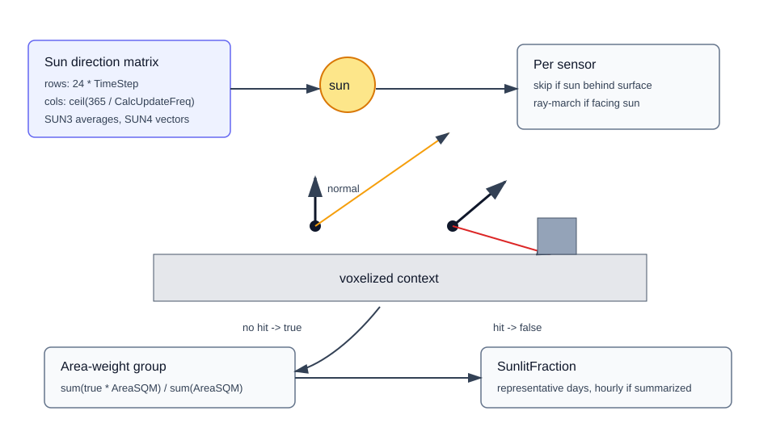

# Sunlit Fraction Calculation



This guide explains how EnergyAtlas computes the sunlit fraction arrays stored on each shading group or sensor shading record.

## Related API References

- [Python reference: `voxel_shading.calculate`](../python-reference.md#voxel_shading)
- [Web reference: `POST /api/voxelShading/calculate`](../web-api-reference.md#controller-endpoint-inventory)
- Result polling: `GET /api/voxelShading/job/{jobId}`, `GET /api/voxelShading/result/{jobId}`

## Source Implementation

- `EnergyAtlasCore/VoxelShading/ShadingCalculation.cs`
- `EnergyAtlasCore/VoxelShading/ShadingResult.cs`
- `EnergyAtlasCore/Geometry/SolarGeometry.cs`
- `EnergyAtlasLib/Preprocessing/TiledSensorShading.cs`

## Solar Direction Grid

`ShadingCalculation.CalculateShading` builds a representative-year sun direction matrix before testing sensors.

1. `calcPerDay = 24 * TimeStep`.
2. `calcPerYear = ceil(365 / CalcUpdateFreq)`.
3. For each update period, `RayMarchingDirectionGen` averages:
   - solar declination from `SolarGeometry.SUN3`
   - equation of time from `SolarGeometry.SUN3`
4. For each hour and sub-hour step, `SolarGeometry.SUN4` returns a unit sun vector, or `null` when the sun is below the horizon.

The matrix shape is:

```text
[24 * TimeStep, ceil(365 / CalcUpdateFreq)]
```

## Per-Sensor Ray Test

`CalculateShadingSingleSensor` evaluates every non-null sun vector for one sensor.

1. If `sunDirection dot sensorNormal < 0`, skip it because the sun is behind the surface.
2. Shoot a ray from `ShadingSensor.Location` in the sun direction.
3. Ray-march through the voxel grid up to `CalculationRadius`.
4. If ray marching returns no voxel hit, mark that matrix cell `true`.
5. Otherwise leave it `false`.

## Group Aggregation

Each `ShadingSensor` has `AreaSQM`; each group is area-weighted.

```text
groupSunlit[cell] =
  sum(sensorIsSunlit[cell] ? sensor.AreaSQM : 0)
  / sum(sensor.AreaSQM)
```

If `SummarizeHourly` is true, sub-hour values are averaged into 24 hourly values per representative day. The output `ShadingResult.TimeStep` is then `1`.

## Parameters

| Parameter | Default | Effect |
| --- | --- | --- |
| `Latitude` | required API request value | Site latitude for sun vector generation. |
| `Longitude` | required API request value | Site longitude for sun vector generation. |
| `TimeZone` | optional | If omitted in the two-stage worker, defaults to `round(longitude / 15)`. |
| `TimeStep` | `6` | Number of calculations per hour. Must divide 60. |
| `SummarizeHourly` | `true` | Averages sub-hour results to hourly values. |
| `CalcUpdateFreq` | `20` | Days represented by each representative-day shading calculation. |
| `CalculationRadius` | `500` | Max ray-marching distance for occluder search. |

## Outputs

| Output field | Meaning |
| --- | --- |
| `SunlitFraction` | Representative-day sunlit fraction array for the surface/sensor record. |
| `CalcUpdateFreq` | Number of days represented by each day slice. |
| `TimeStep` | Output steps per hour; `1` when summarized hourly. |
| `SkyViewFactor` / `HorizonViewFactor` | Present when diffuse calculations are enabled. |

## Interpretation

The API shading result is not a direct radiation value. It is a geometric visibility result. Weather-file DNI/DHI and Perez sky components are applied later by `Weather.ComputeAnnualIncidentRadiationFromShadingResult`.
