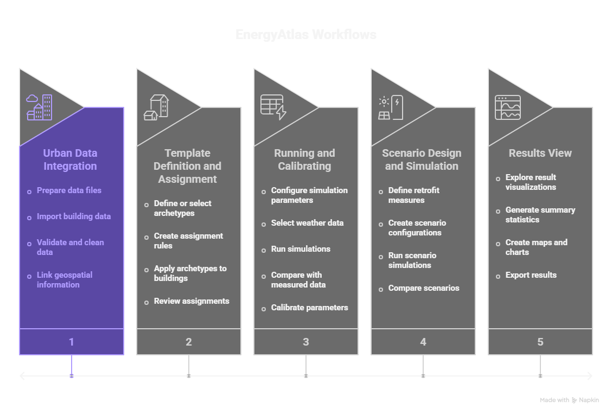

# Workflows Guide

Overview of common workflows in EnergyAtlas for urban building energy modeling.

{.full-width}

## Introduction

This guide provides an overview of the main workflows available in EnergyAtlas. Each workflow is designed to accomplish specific tasks in the UBEM process, from data preparation to results analysis.

## Core Workflows

### 1. Urban Data Integration

**Purpose**: Import and process urban building datasets

**When to use**: Starting a new project or adding data to existing project

**Key steps**:
- Prepare data files
- Import building data
- Validate and clean data
- Link geospatial information

**See**: [Urban Data Integration Workflow](workflows/urban-data-integration.md)

### 2. Template Definition and Assignment

**Purpose**: Create building archetypes and assign them to buildings

**When to use**: After importing building data, before running simulations

**Key steps**:
- Define or select archetypes
- Create assignment rules
- Apply archetypes to buildings
- Review assignments

**See**: [Template Definition and Assignment Workflow](workflows/template-definition-assignment.md)

### 3. Running and Calibrating

**Purpose**: Execute energy simulations and calibrate models

**When to use**: After archetype assignment, to generate energy consumption estimates

**Key steps**:
- Configure simulation parameters
- Select weather data
- Run simulations
- Compare with measured data
- Calibrate parameters

**See**: [Running and Calibrating Workflow](workflows/running-calibrating.md)

### 4. Scenario Design and Simulation

**Purpose**: Create and evaluate energy retrofit scenarios

**When to use**: To analyze potential energy savings from interventions

**Key steps**:
- Define retrofit measures
- Create scenario configurations
- Run scenario simulations
- Compare scenarios

**See**: [Scenario Design and Simulation Workflow](workflows/scenario-design-simulation.md)

### 5. Results View

**Purpose**: Analyze and visualize simulation results

**When to use**: After simulations complete, to understand and present findings

**Key steps**:
- Explore result visualizations
- Generate summary statistics
- Create maps and charts
- Export results

**See**: [Results View Workflow](workflows/results-view.md)

## Workflow Sequence

A typical EnergyAtlas project follows this sequence:

```
1. Urban Data Integration
   ↓
2. Template Definition and Assignment
   ↓
3. Running and Calibrating
   ↓
4. Scenario Design and Simulation (optional)
   ↓
5. Results View
```

## Workflow Best Practices

### Planning

- **Define objectives**: Know what questions you want to answer
- **Assess data**: Understand what data you have and what's missing
- **Plan iterations**: Expect to refine models through multiple iterations

### Execution

- **Start simple**: Begin with basic archetypes and refine
- **Validate early**: Check data quality before processing
- **Document decisions**: Keep track of assumptions and choices
- **Iterate**: Refine models based on results

### Quality Assurance

- **Check inputs**: Verify data quality at each step
- **Validate outputs**: Compare results with expectations
- **Review assumptions**: Question modeling decisions
- **Document process**: Record workflow steps and parameters

## Common Workflow Patterns

### New Project

1. Import building data
2. Assign archetypes
3. Run baseline simulation
4. Analyze results

### Retrofit Analysis

1. Import building data
2. Assign archetypes
3. Run baseline simulation
4. Create retrofit scenarios
5. Run scenario simulations
6. Compare results

### Calibration Project

1. Import building data
2. Import measured consumption data
3. Assign archetypes
4. Run initial simulation
5. Compare with measured data
6. Calibrate parameters
7. Re-run simulation
8. Validate calibration

## Workflow Integration

Workflows can be combined and repeated:

- **Iterative refinement**: Repeat workflows to improve models
- **Parallel scenarios**: Run multiple scenarios simultaneously
- **Comparative analysis**: Compare results across workflows
- **Batch processing**: Apply workflows to multiple datasets

## Getting Help

If you encounter issues with workflows:

1. Check workflow-specific documentation
2. Review [FAQ](../resources/faq.md)
3. Verify data requirements are met
4. Check error messages for guidance

## Next Steps

- Review individual workflow guides for detailed procedures
- Explore [Objects Reference](objects/datahub.md) for data model details
- See [Resources](../resources/archetype-library.md) for libraries and templates
