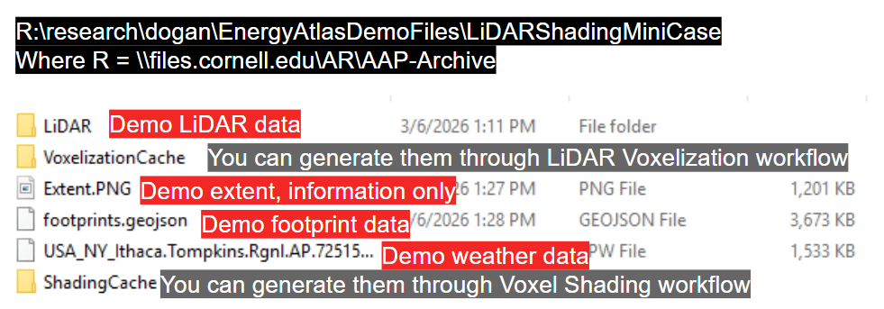
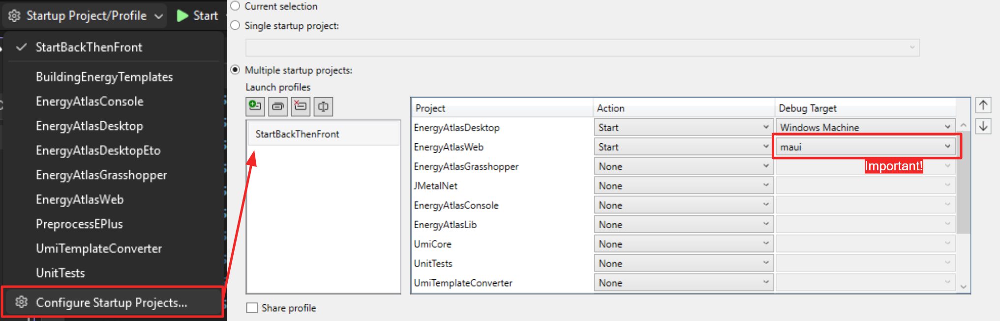
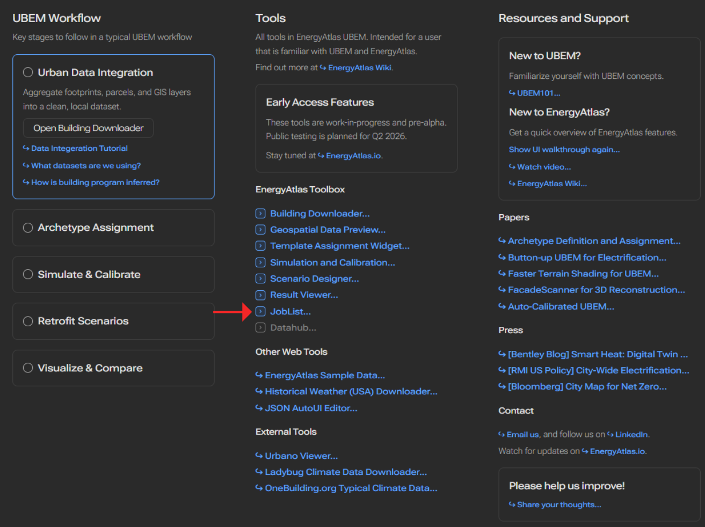
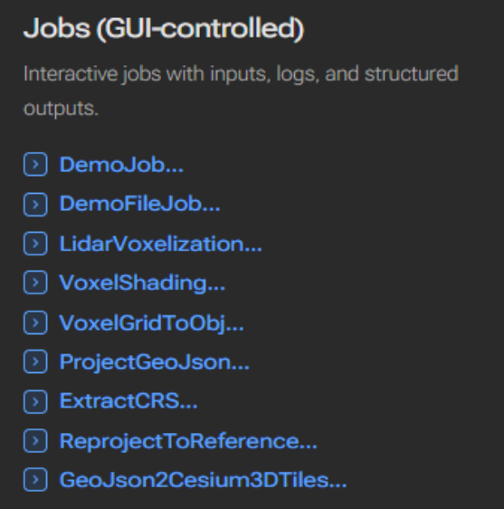
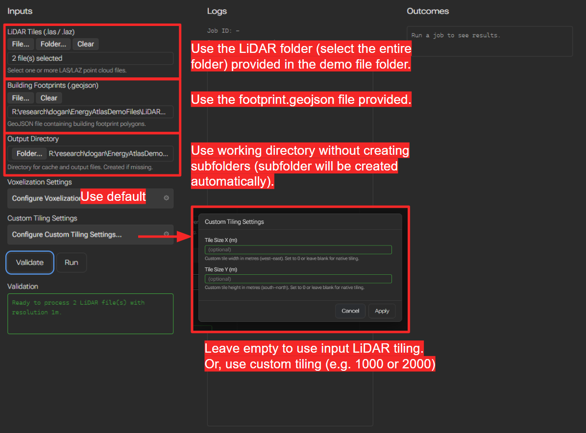
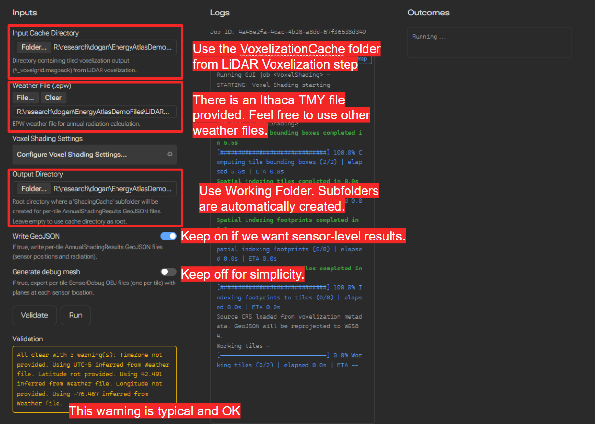
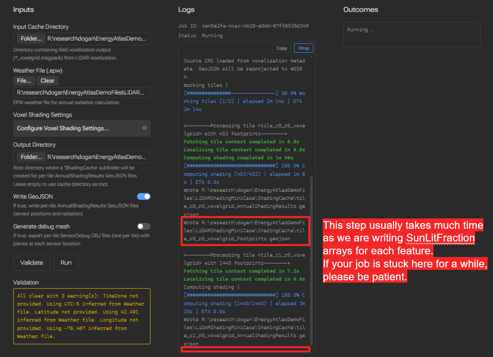

# LiDAR Workflows
## Setup
Fetch the demo files

Set up the startup project in Visual Studio (these settings are not `git` controlled, so we have to configure manually for each machine)

### Maui

Make sure the `Debug Target` is `maui` for the `EnergyAtlasWeb` project. This determines the `ExecutionMode` of the application and whether it will have access to the local file system or remain as a typical browser web app.

### Eto
Code changes not yet committed; not supported for the moment, apoligies.

## Navigating to Jobs

Navigation to the Job List page to find the list of jobs available.

Focus on the middle column with `GUIJobs`

## LiDAR Voxelization Workflow
The `LidarVoxelization` job will voxelize classified LiDAR inputs and drape footprint geometries on the LiDAR tiles to produce the voxelization cache for shading calculation.

Successfully running this workflow will result in a folder within the working directory called `VoxelizationCache`, inside which 2 set of files are created:
- A `_LiDARVoxelization_metadata.json` which records inputs and most importantly, projection information as WKT. They are necessary for the shading workflow to produce the `geojson` with correct geospatial coordinates.
- As many `tile_c{TileXCoord}_r{TileYCoord}_voxelgrid.msgpack` files as the number of tiles (including empty tiles). They contain both voxelgrid and draped meshes for each tile.

## Voxel Shading Workflow

The `VoxelShading` job will compute shading using the voxel ray-marching approach. Detailed steps and inputs:

> Note: in the latest version, a new toggle is added to allow the user to export full `SunLitFraction` arrays in sensor-level outputs.

Successfully running this workflow will result in a folder within the working directory called `ShadingCache`, with files:

- As many `tile_c{TileXCoord}_r{TileYCoord}_voxelgrid_Footprints.geojson` files as the number of tiles (including empty tiles). They include building footprint level results (aggregated) with full `SunLitFraction` arrays.
- (If you opted in for `Write GeoJSON` in the input) As many `tile_c{TileXCoord}_r{TileYCoord}_voxelgrid_AnnualShadingResults.geojson` files as the number of tiles (including empty tiles). They include sensor-level results with 3d coordinates.
- (If you opted in for `Generate debug mesh` in the input) Tile-level sensor debug meshes as `obj` files. For each sensor, a debug square mesh (quad) will be generated, with the correct area of that sensor, normal direction of that sensor, and a color scheme that matches the shading results (for qualitative inspections only, no legend provided).

## (Optional) Voxel Grid MessagePack to OBJ Files

The job `VoxelGridToObj` allows you to convert 1 or many `.msgpack` voxel grid cache to obj files. The output obj files will contain both voxelized LiDAR and draped footprint base, facade, and roof meshes.

## (Optional) Shading Result to Cesium 3D Tiles (.GLB) Workflow

The job `GeoJson2Cesium3DTiles` allows you to convert shading cache sensor-level result `.geojson` files (tiled) to a Cesium ion 3d tiles format (`.glb` 3d geometry file and a `tileset.json` tileset spec file).