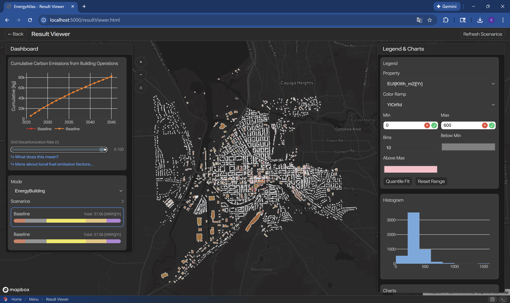

# Results View

Workflow for analyzing, visualizing, and exporting simulation results in EnergyAtlas.

## Overview

The results view workflow helps you explore simulation outputs, generate insights, create visualizations, and export data for further analysis or reporting.

## Step 0: Carbon Projection

{.full-width}

Results view panel is still under active development.

Please try the [Urbano Viewer](https://viewer.urbano.io/) instead. [Urbano](https://urbano.io/) is a free plugin to [Rhinoceros 3D](https://www.rhino3d.com/).

## Next Steps

After analyzing results:

- [Scenario Design](scenario-design-simulation.md) - Create new scenarios
- [Running and Calibrating](running-calibrating.md) - Refine models
- [Workflows Guide](../workflows.md) - Other workflows

## Related Documentation

- [Input Output Guide](../input-output.md) - Export formats
- [Objects Reference](../objects/datahub.md) - Data model
- [FAQ](../../resources/faq.md) - Common questions
