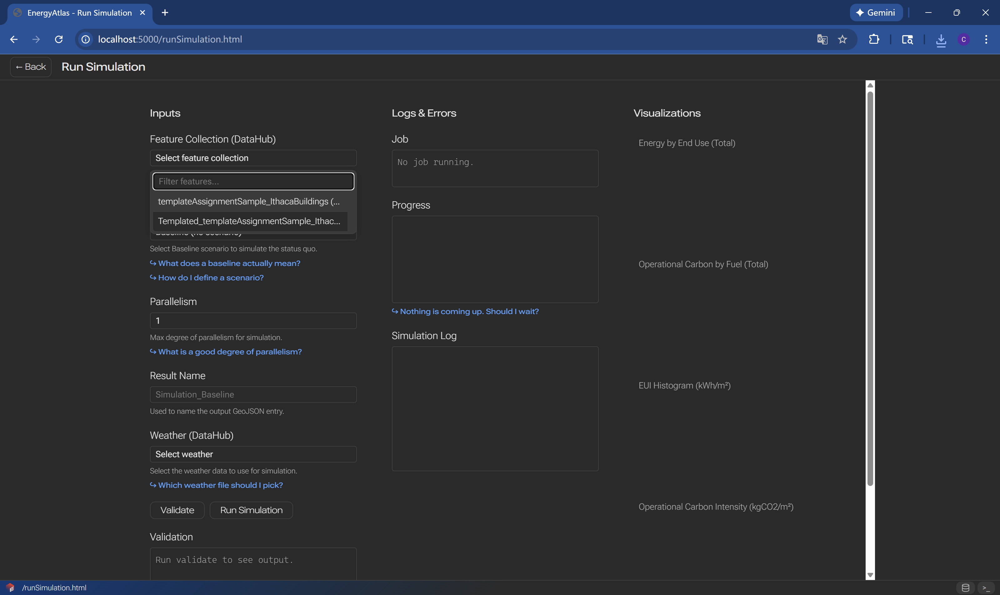
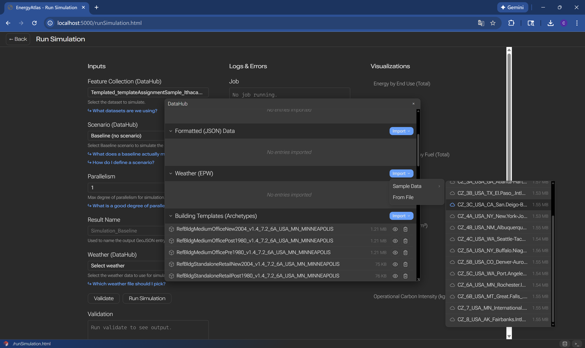
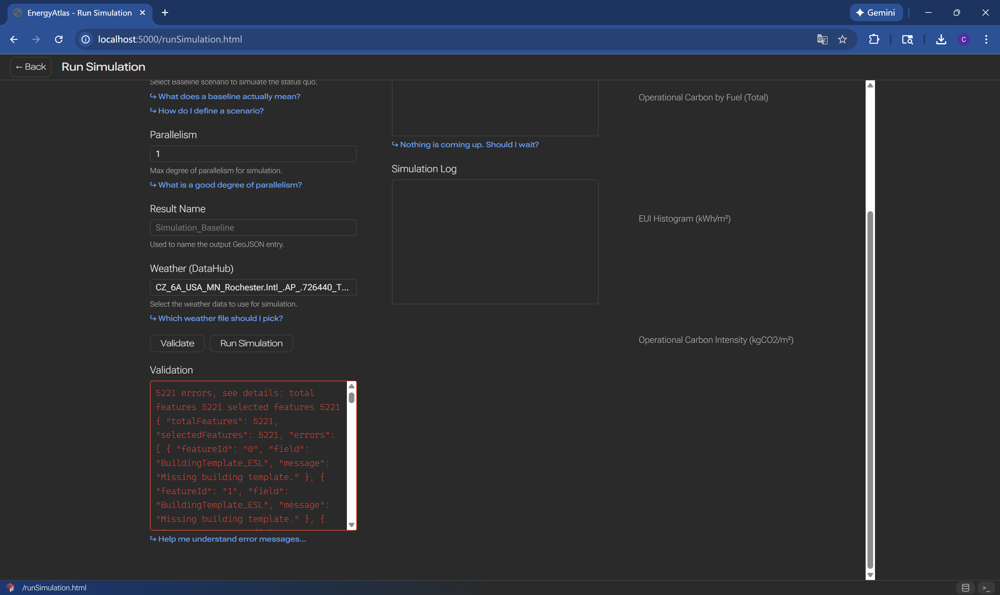
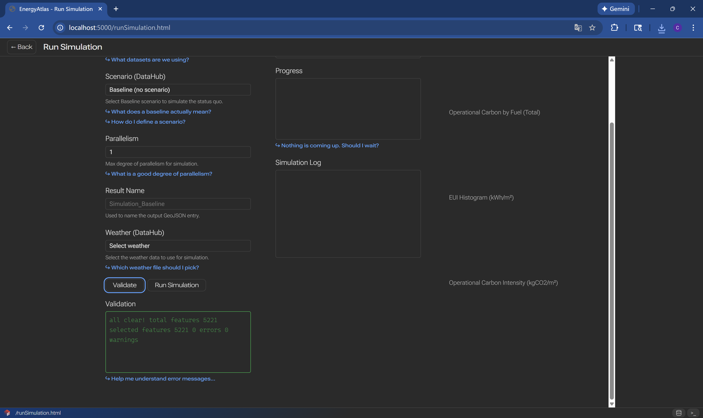
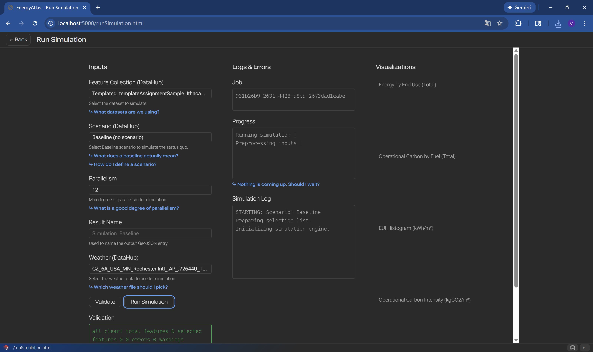
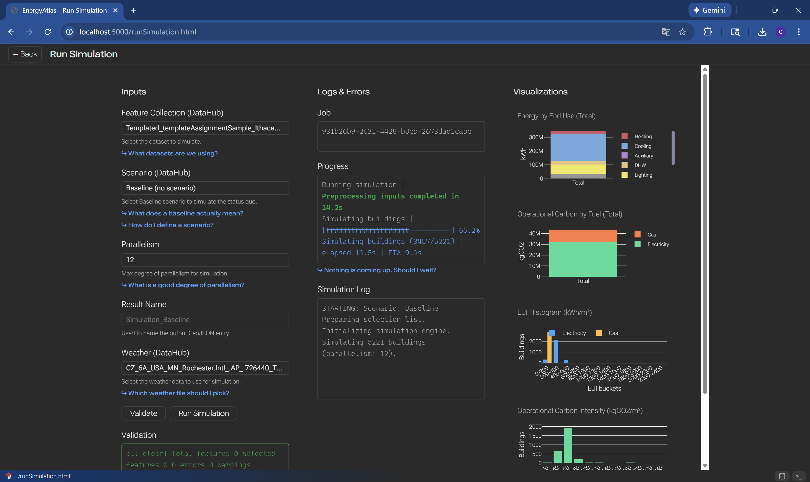
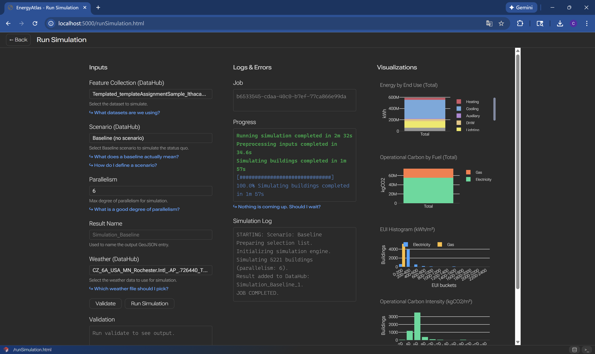

# Running and Calibrating

Workflow for executing energy simulations and calibrating models to match measured consumption data.

## Overview

Running simulations generates energy consumption estimates for your building stock. Calibration adjusts model parameters to better match observed consumption patterns, improving model accuracy.

## Step 1: Load Feature Collection (Dataset)

{.full-width}

## Step 2: Pick Scenario

## Step 3: Set Simulation Parameters

## Step 4: Load Weather
{.full-width}

## Step 5: Validate Inputs

{.full-width}

{.full-width}

## Step 6: Running Simulations
{.full-width}

{.full-width}

## Step 7: Completion
{.full-width}

## Next Steps

After calibration:

- [Scenario Design and Simulation](scenario-design-simulation.md) - Create retrofit scenarios
- [Results View](results-view.md) - Analyze and visualize results
- [Workflows Guide](../workflows.md) - Other workflows

## Related Documentation

- [Archetype Object](../objects/archetype.md) - Archetype parameters
- [Weather File](../objects/weather-file.md) - Weather data specifications
- [FAQ](../../resources/faq.md) - Common questions
