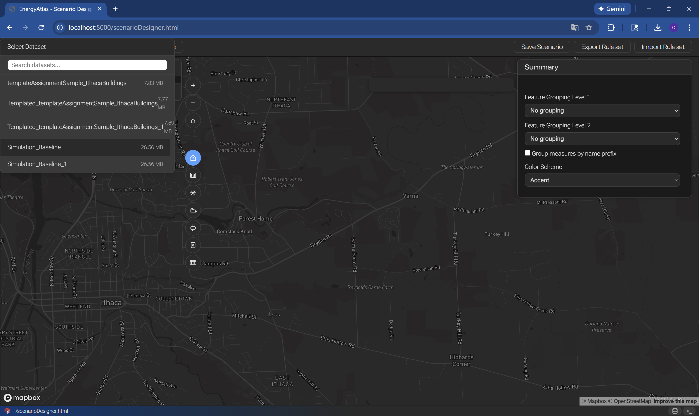
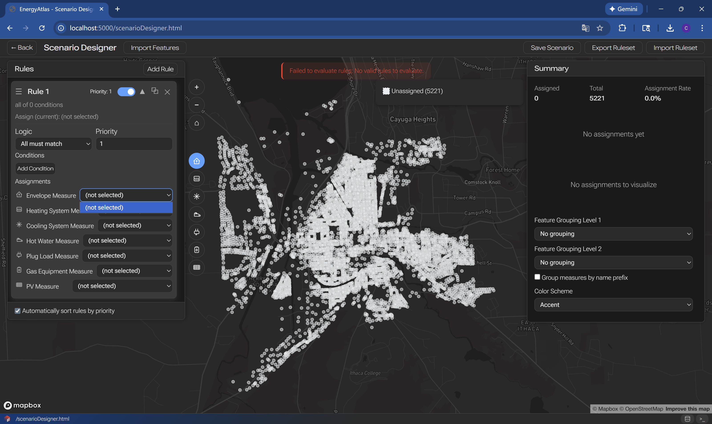
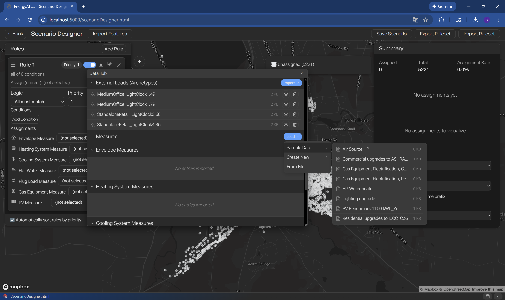
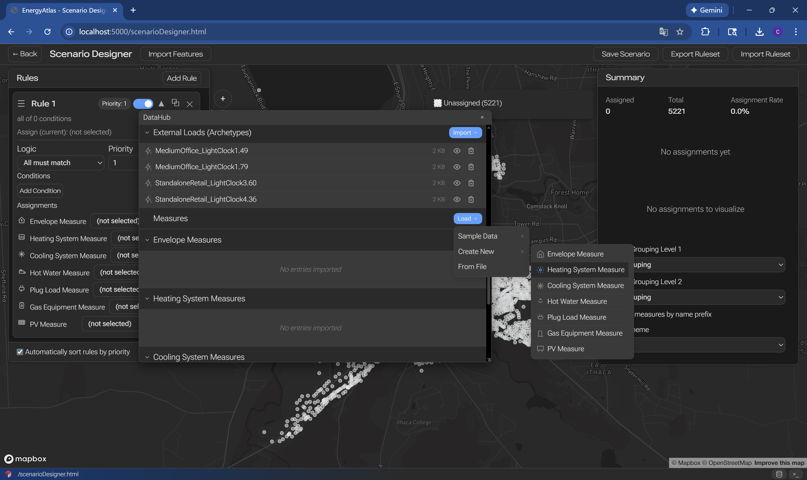
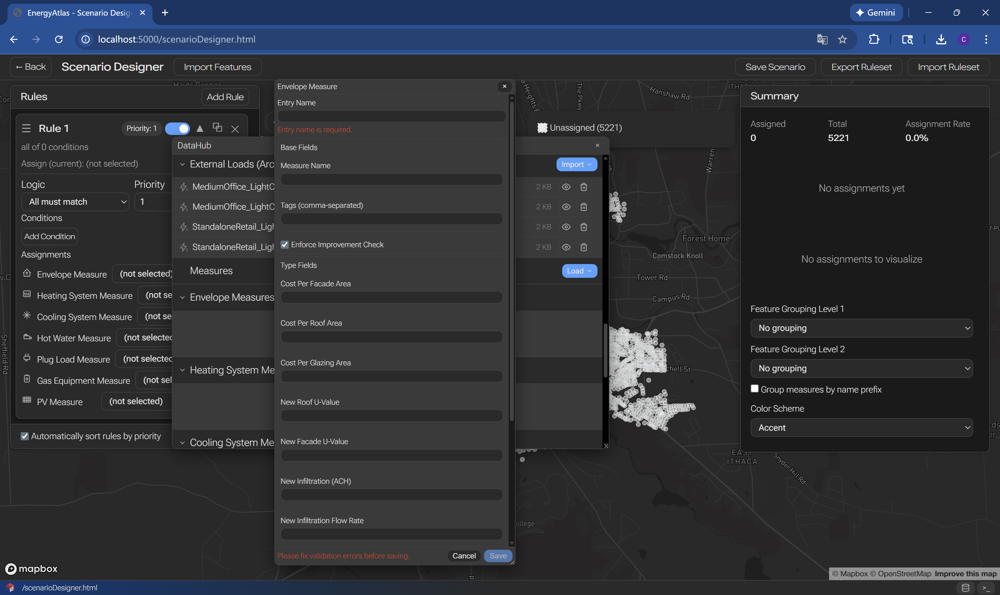

# Scenario Design and Simulation

Workflow for creating energy retrofit scenarios and running comparative simulations.

## Overview

Scenario design allows you to model the impact of energy efficiency interventions across your building stock. This workflow covers creating scenarios, defining retrofit measures, running scenario simulations, and comparing results.

## Step 1: Load Data

{.full-width}
{.full-width}

## Step 2: Load Retrofit Measure from Sample Data
{.full-width}

## Step 3: Create Your Own Retrofit Measure
{.full-width}

{.full-width}
## Step 4: Switch Layers and Visualize Your Retrofit Measure Application Logic
{.small}

## Next Steps

After scenario analysis:

- [Results View](results-view.md) - Detailed results analysis
- [Retrofit Measures Library](../../resources/retrofit-measures-library.md) - Available measures
- [Scenario Object](../objects/scenario.md) - Scenario specifications

## Related Documentation

- [Running and Calibrating](running-calibrating.md) - Baseline simulation
- [Retrofit Measure Object](../objects/retrofit-measure.md) - Measure specifications
- [Workflows Guide](../workflows.md) - Other workflows
