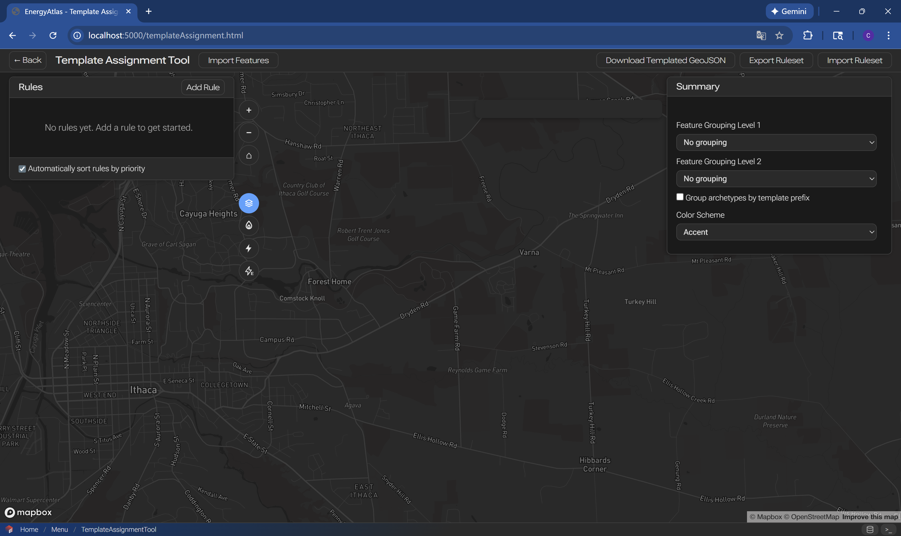
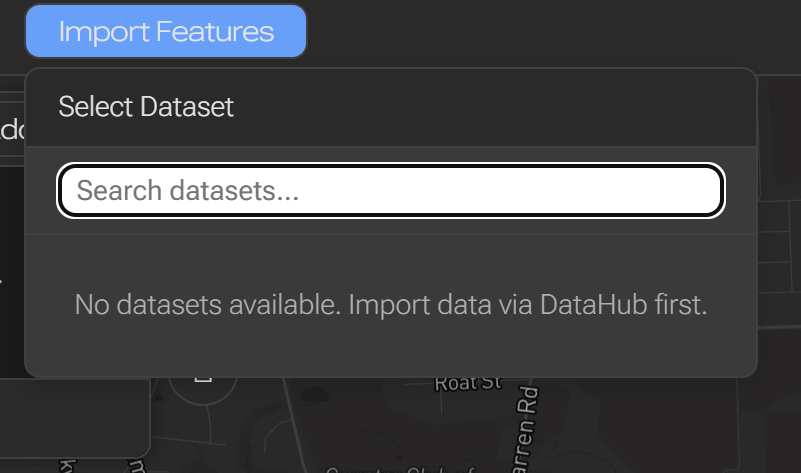
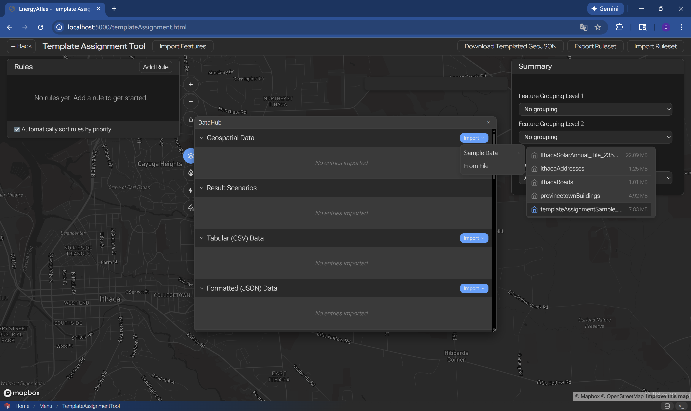
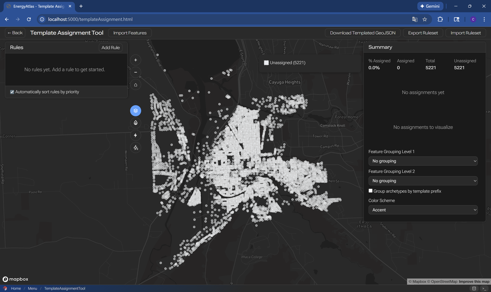
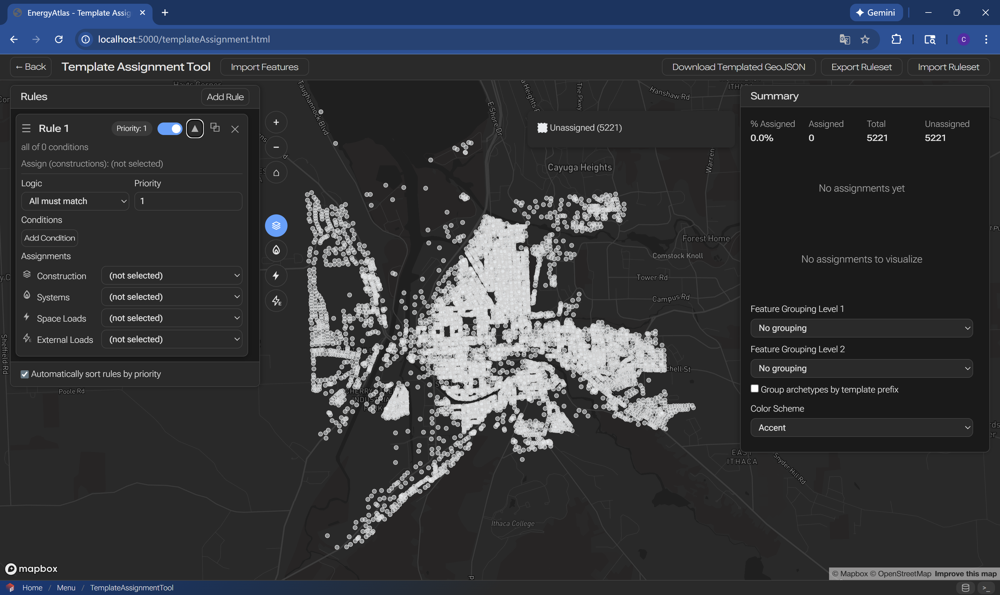
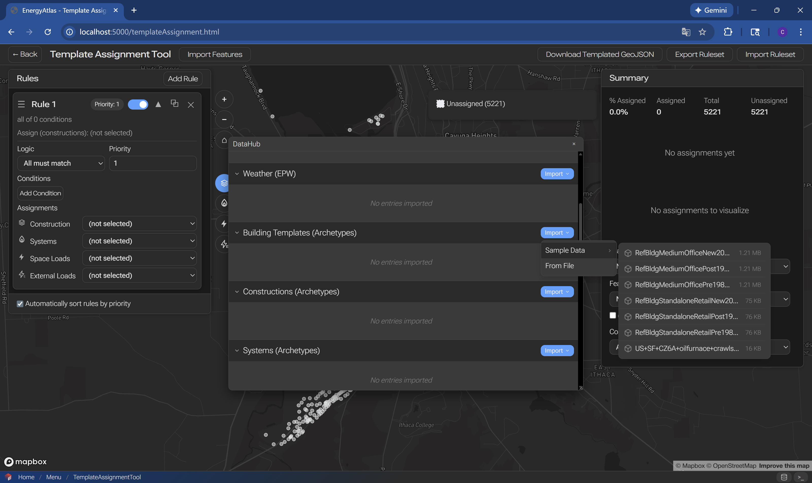
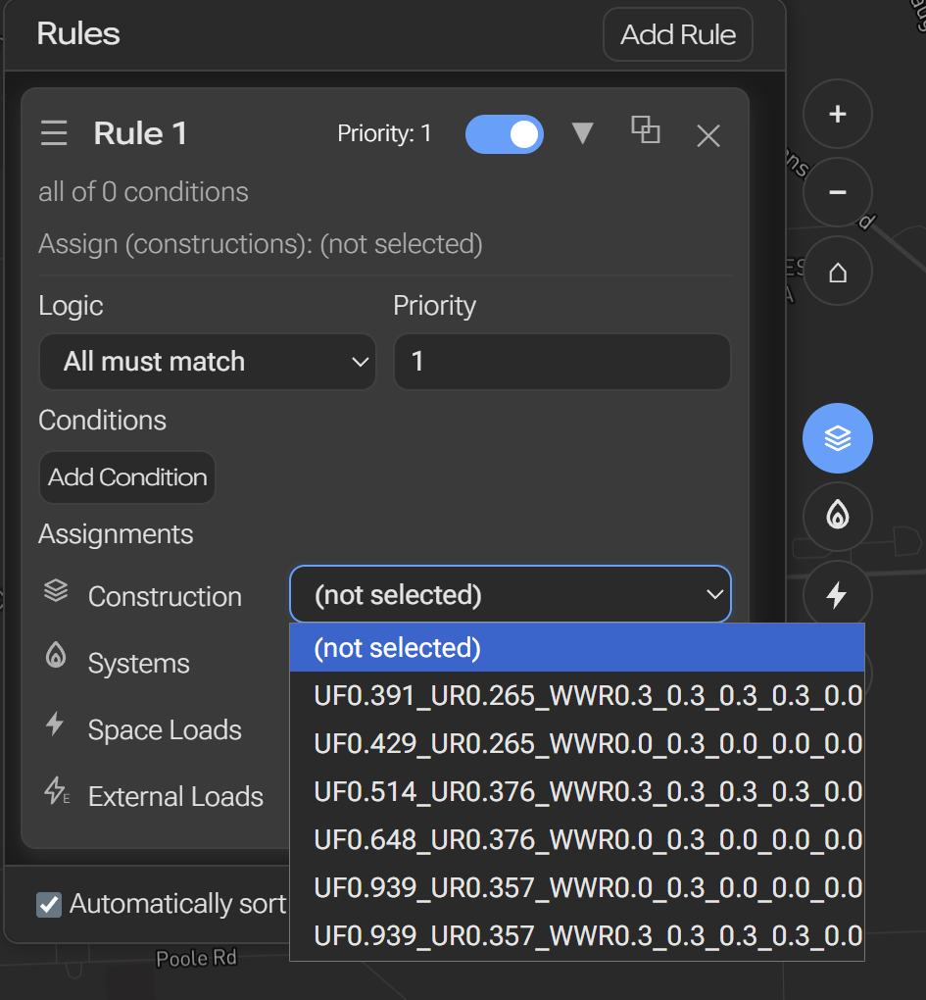
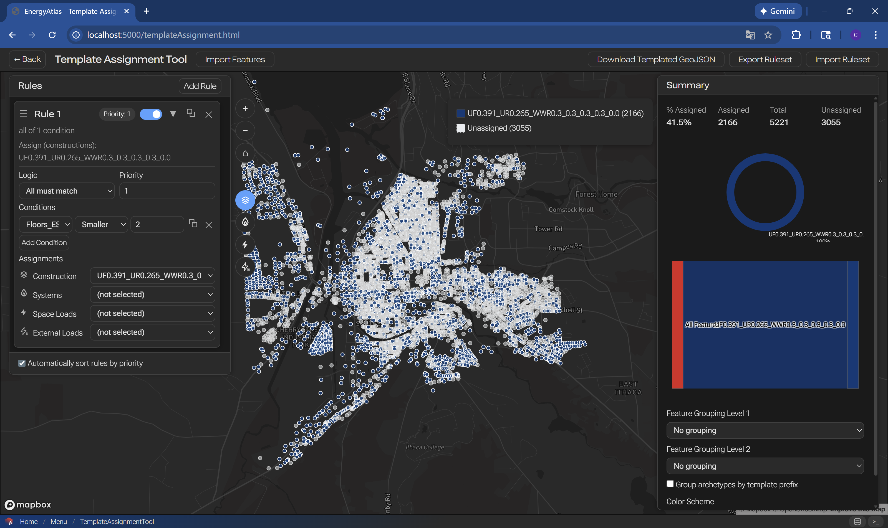
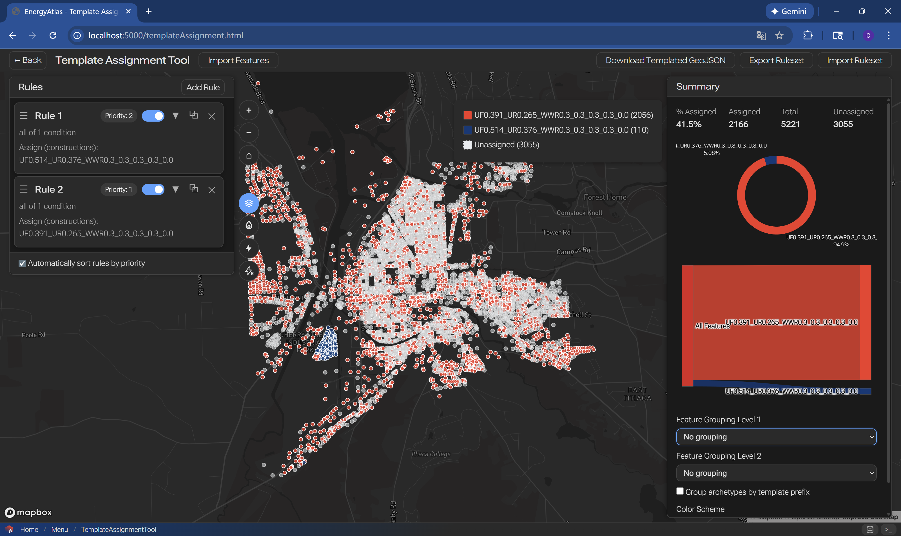
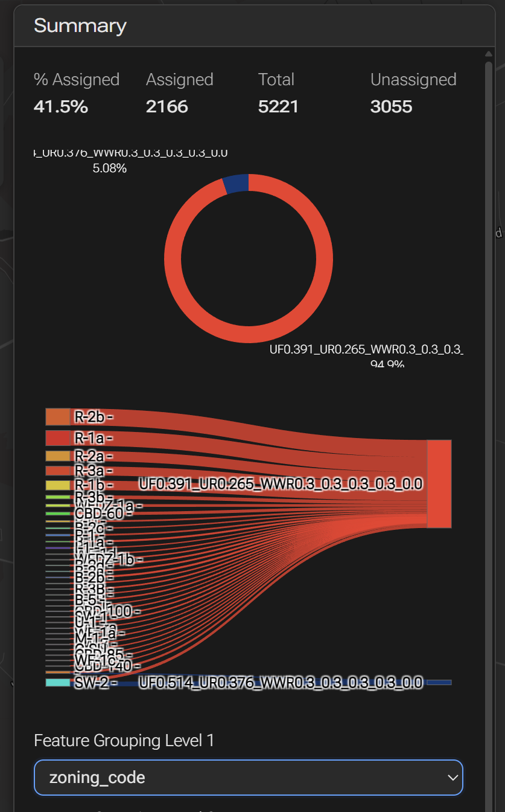

# Template Definition and Assignment

Workflow for creating building archetypes (templates) and assigning them to buildings in your dataset.

## Overview

Template definition and assignment is a critical step that maps your building data to representative energy models (archetypes). This workflow covers creating archetypes, defining assignment rules, and applying them to buildings.

## Step 1: Load Data

{.full-width}
{.small}

{.full-width}
{.full-width}

{.full-width}

## Step 2: Load Archetypes (Templates)

{.full-width}
{.small}
## Step 3: Create Rules
{.full-width}

## Step 4: Visualize Rules
{.full-width}
{.small}
{.small}
## Step 5: Export Rules
{.small}

## Next Steps

After assigning archetypes:

- [Running and Calibrating](running-calibrating.md) - Run energy simulations
- [Archetype Object](../objects/archetype.md) - Learn about archetype structure
- [Archetype Assignment Rule](../objects/archetype-assignment-rule.md) - Rule specifications

## Related Documentation

- [Archetype Library](../../resources/archetype-library.md) - Available archetypes
- [Archetype Object](../objects/archetype.md) - Archetype data model
- [Workflows Guide](../workflows.md) - Other workflows
