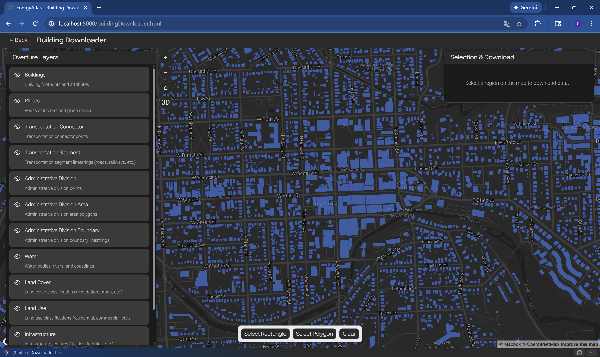
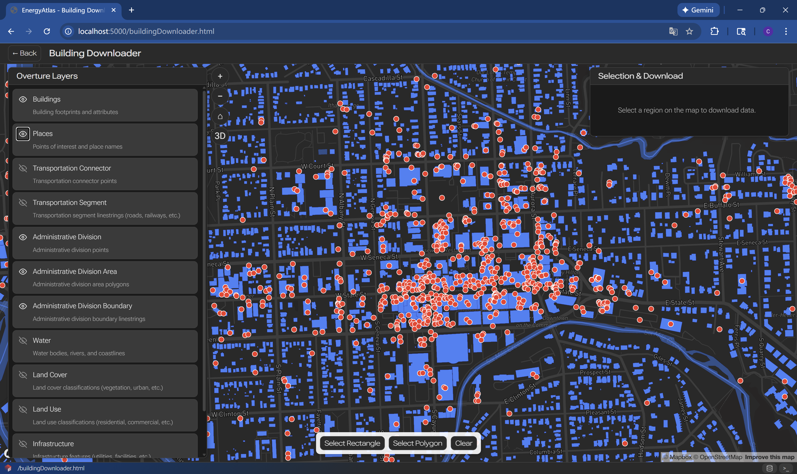
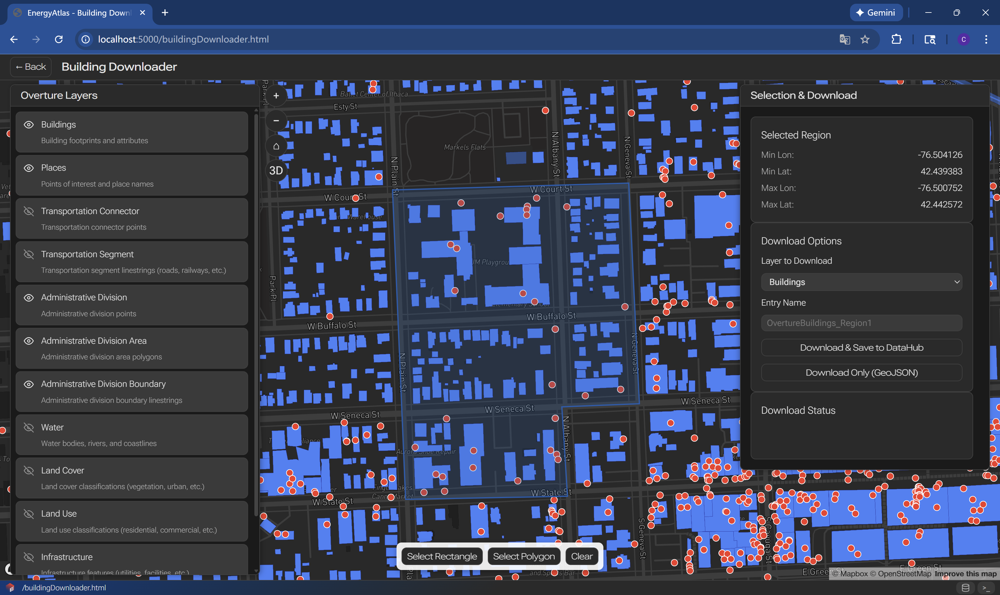
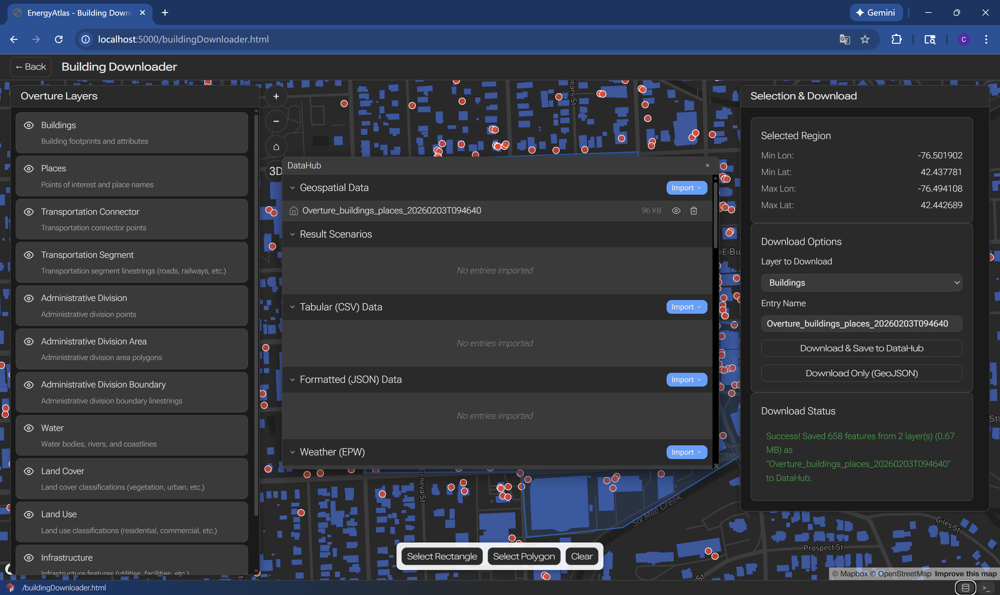

# Urban Data Integration

Step-by-step workflow for importing and integrating urban building data into EnergyAtlas.

## Overview

Urban data integration is the first step in any EnergyAtlas project. This workflow guides you through importing building data, validating it, and preparing it for archetype assignment and simulation.

## Prerequisites

Before starting, ensure you have:

- Building data in a supported format (GeoJSON, CSV, or Shapefile)
- Required fields populated (building_id, location, building_type, year_built)
- Data quality checked and cleaned
- Access to EnergyAtlas platform

## Step 1: Initialize Building Downloader

{.full-width}

Building pmtiles preview will be available if you click on the Buildings layer's eye icon once. These geometries indicate the density of building data availability. Empty regions indicate lower built-up density.

## Step 2: Zoom in to Area of Interest
{.full-width}

When zoomed in to a location or region of your choice, building geometries will appear at a closer zoom level. You may also turn on other layers to preview all data available for the given area. For example:

{.full-width}

We recommend you leave at least the 2 layers on:

- Buildings
- Places (POIs)

They are crucial for EnergyAtlas to infer building type- and use-related information. Below is an example:

{.full-width}

## Step 3: Select Download Area

Use the selection tool at the bottom of the interface, you will be able to specify an area of interest on the map. There are 2 modes available:

- Selection by rectange: you will be prompted to draw a rectangle and all buildings that `touch` the selection rectangle will be selected. This is a faster way of making building selection.
- Selection by hand-drawn polygon: you will be prompted to draw a polygon by clicking on all the vertices of the polygon in order. All buildings that `touch` the selection polygon will be selected. When you are finished with your selection, simply click `Complete Polygon` button to finalize your selection.

If successful, you will get this interface:

{.full-width}

On the right panel you will be prompted with 2 options:

- Download & Save to [Datahub](../objects/datahub.md)
- Download Only (GeoJSON): this will trigger a browser download and save a local `.geojson` file that contains selected features contained in all visible layers. You will easily be able to open and preview it with [QGIS](https://qgis.org/).

{.full-width}

If you have successfully downloaded the features and saved to [Datahub](../objects/datahub.md), you will find a new entry matching the name you specified in Entry Name field (or the default name) in the [Datahub](../objects/datahub.md) tab, which is accessible from the bottom-right corner of the page.

## Step 4: (Optional) Preview Your Geospatial Data

The [Spatial Data Preview Tool](spatial-data-preview.md) could help you peek the dataset you just downloaded. Visit [Spatial Data Preview Tool](spatial-data-preview.md) for more instructions.

## Next Steps

After successfully importing data:

- [Template Definition and Assignment](template-definition-assignment.md) - Assign archetypes to buildings
- [Data Preparation](../data-prep.md) - Learn more about data requirements
- [Objects Reference](../objects/datahub.md) - Understand data model

## Related Documentation

- [Input Output Guide](../input-output.md) - File formats and structures
- [Datahub Object](../objects/datahub.md) - Datahub documentation
- [Geospatial Data](../objects/geospatial-data.md) - Geospatial data specifications
