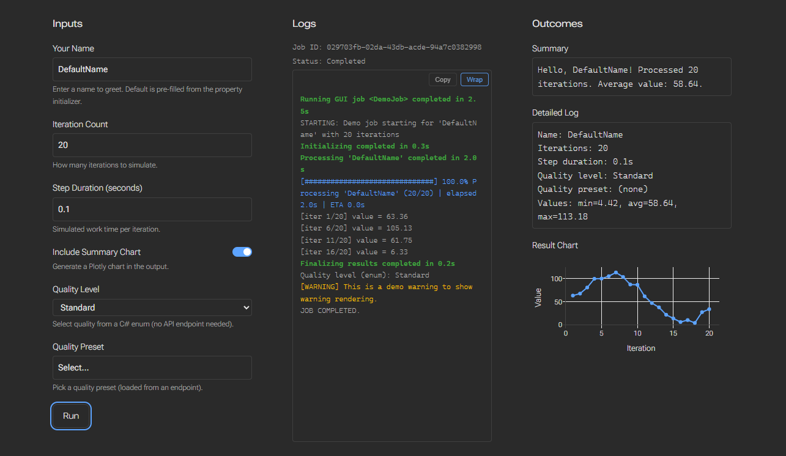
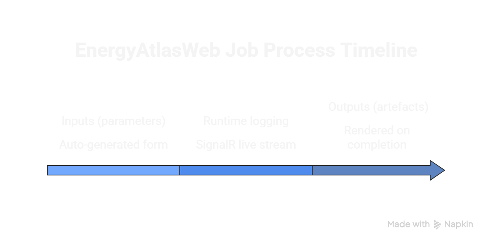
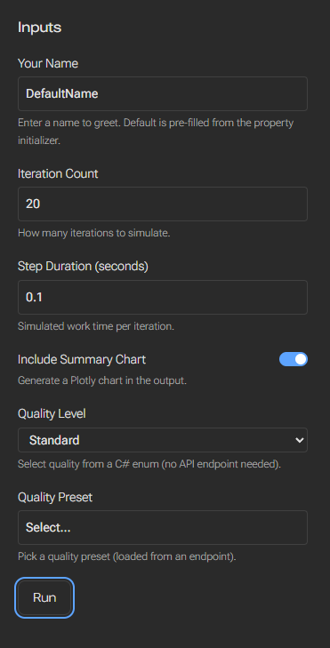
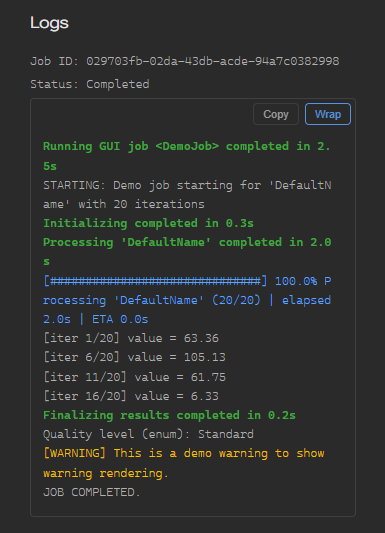
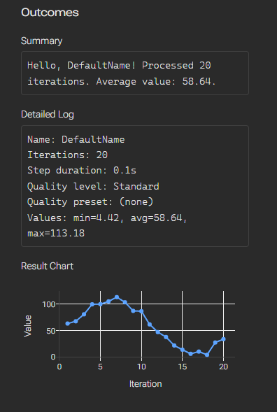
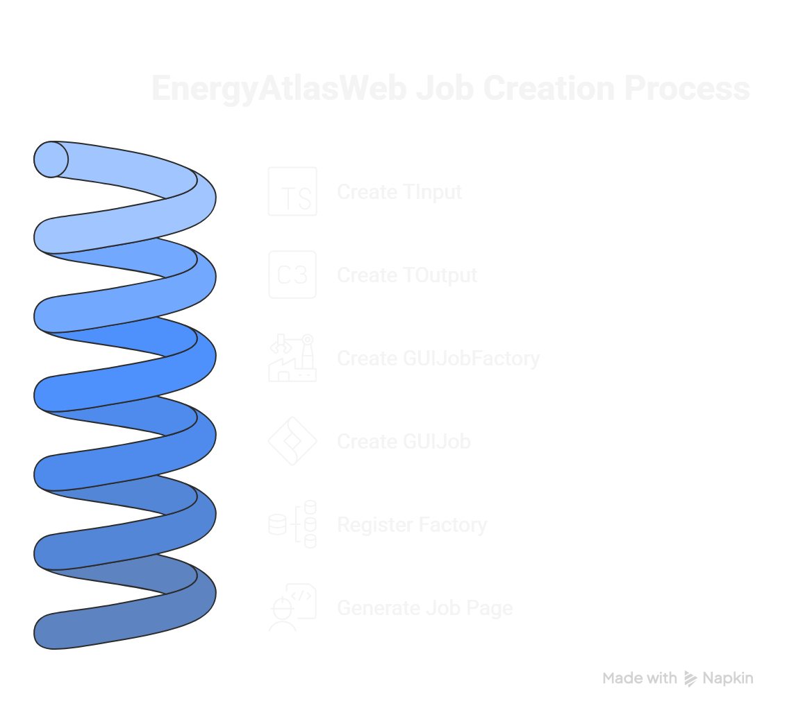

# EnergyAtlasWeb Job with Graphic User Interface (GUI)

The GUI Job system **automatically generates** a complete job page — input form, real-time log
stream, and output display — from a pair of C# input/output classes decorated with
`[JobInput]` / `[JobOutput]` attributes. No HTML or JavaScript is written per job.

{.full-width}

## GUI Job Page layout

A GUI Job page has **three sections**, rendered in order (left to right on the page, top to bottom in the diagram below):



```
Auto-generated form
┌──────────────────────────────────────────┐
│  Inputs (parameters)                     │
│  [Run]  ([Validate])                     │
└──────────────────────────────────────────┘

SignalR live stream
┌──────────────────────────────────────────┐
│  Runtime logging                         │
│  (progress bars, binary spinners, logs)  │
└──────────────────────────────────────────┘

Rendered on completion
┌──────────────────────────────────────────┐
│  Outputs (artefacts)                     │
│  (text, charts, download/reveal links)   │
└──────────────────────────────────────────┘
```


## Architecture overview

```
[JobInput] C# Attributes
on TInput class
        │
        ▼
GUIJobReflection
        │
        ▼
/api/guiJob/…/schema
        │
        ▼
Dynamic HTML Form
        ▲
        │
[JobOutput] C# Attributes
on TOutput class

```

1. Developer defines `TInput` and `TOutput` classes with `[JobInput]` and `[JobOutput]` attributes.
2. `GUIJobReflection` reads the attributes at startup and produces `InputFieldDescriptor` /
   `OutputFieldDescriptor` lists.
3. `GUIJobFactoryBase<TInput, TOutput>` exposes them via the `IGUIJobFactory` interface.
4. `GET /api/guiJob/{jobName}/schema` returns the descriptors as JSON.
5. The frontend (`jobRunner.js`) renders the form based on a fixed base html and output widgets from those descriptors. In other words, all input, log, and output elements are generated on-the-fly with the same base HTML file.


## 1. Inputs (parameters)

{.small}

### `[JobInput]` attribute

> TODO: Hook API doc link in the future.
> `EnergyAtlasWeb/Jobs/GUIJobs/GUIJobAttributes.cs`

```csharp
[JobInput("Label text",
    // optional — inferred from property type
    FieldType     = InputFieldType.Text,
    HelperText    = "Shown below the field",
    Placeholder   = "Greyed-out hint",
    // for Picker / DataHubFile(s)
    SourceEndpoint = "/api/...",
    // for file fields
    AllowedExtensions = ".txt,.csv",
    // for Number / Int
    Min = 0, Max = 100, Step = 1
)]
public string MyParam { get; set; } = "default";
```

### Supported `InputFieldType` enum values

| Type | C# type | Rendered as |
|------|------------------------|-------------|
| `Text` | `string` | Text input |
| `Number` | `double`, `float` | Numeric input (min/max/step) |
| `Int` | `int` | Integer input (min/max/step) |
| `Boolean` | `bool` | Checkbox |
| `Enum` | any `enum` | Dropdown (options from enum names) |
| `Picker` | `string` | Dropdown populated from `SourceEndpoint` |
| `LocalFile` | `string` | See [Working with Local Files](file-sys-access.md)|
| `LocalFiles` | `string` (JSON array) | Multi-file picker |
| `FolderPath` | `string` | Directory picker |
| `DataHubFile` | `string` | DataHub single-file selector |
| `DataHubFiles` | `string` | DataHub multi-file selector |

### Default values

The `DefaultValue` in the descriptor is read from the property's initial value in the `new TInput()`
default constructor.

The frontend pre-populates the form with these defaults.

## 2. Runtime logging

{.small}

During `Run()`, the job reports progress through `IJobReporter` (received as the second argument).
All signal types are streamed to the frontend in real time via SignalR.

> See [SignalR Logging](report-logs.md) for the full reference on signal types, `BinaryProgress`, `TQDM`, and how each renders.

Quick summary of what's available inside `Run()`:

```csharp
// Binary spinner (done/working)
using (var bp = new BinaryProgress(
    reporter, label: "Loading"))
{
    // ... work ...
}   // auto-completes on dispose

// Percentage progress bar
using (var tq = new TQDM(
    reporter, total: items.Count,
    label: "Processing"))
{
    foreach (var item in items)
    {
        Process(item);
        tq.Increment();
    }
}

// Free-form log lines
reporter.Report(JobSignal.Log(
    message: "Intermediate result: 42"));
reporter.Report(JobSignal.Warning(
    message: "File is unusually large"));
reporter.Report(JobSignal.Error(
    message: "Fatal: missing column"));
```


## 3. Outputs (artefacts)

{.small}

### `[JobOutput]` attribute

> `EnergyAtlasWeb/Jobs/GUIJobs/GUIJobAttributes.cs`

```csharp
[JobOutput("Label text",
    // optional — inferred from property type
    FieldType = OutputFieldType.Text
)]
public string Summary { get; set; }
```

### Supported `OutputFieldType` values

| Type | C# type (auto-inferred) | Rendered as |
|------|------------------------|-------------|
| `Text` | `string` | Read-only text box |
| `PlotlyChart` | `PlotlyChartData` | Interactive Plotly chart (`DataJson` + `LayoutJson`) |
| `File` | `OutputFileReference` or `List<OutputFileReference>` | Download link or reveal-in-folder |

### `OutputFileReference`

> `EnergyAtlasWeb/Jobs/GUIJobs/GUIJobModels.cs`

```csharp
public class OutputFileReference
{
    // link text
    public string DisplayName { get; set; }
    // file path (on-disk outputs only)
    public string Reference { get; set; }    
    // key for download API (download outputs only)    
    public string ArtifactKey { get; set; }      
    // MIME type (download outputs only)
    public string ContentType { get; set; }      
    // true -> open folder; false -> download via api
    public bool IsOnDisk { get; set; } = true; 
}
```

- **On-disk** (`IsOnDisk = true`): The file exists at `Reference`. The frontend shows a
  folder icon and calls `POST /api/guiJob/revealInFolder?path=...` to open the containing folder.
- **Download** (`IsOnDisk = false`): No file on disk. The job registers the blob in the
  artifact sink during `Run()`, sets `ArtifactKey`, and the frontend links to
  `GET /api/guiJob/{jobId}/download/{artifactKey}`.

> See [Working with Local Files](file-sys-access.md) for the full artifact sink design and file
> access differences across [Execution Modes](exec-modes.md).


## Factory and registration

### `GUIJobFactoryBase<TInput, TOutput>`

> `EnergyAtlasWeb/Jobs/GUIJobs/GUIJobFactoryBase.cs`

Abstract generic base that handles all the plumbing:

```csharp
public abstract class GUIJobFactoryBase<TInput, TOutput> : IGUIJobFactory
    where TInput : class, new()
    where TOutput : class, new()
{
    public abstract string JobName { get; }
    public abstract string JobDescription { get; }

    // Reflection-derived descriptors (populated in constructor)
    public IReadOnlyList<InputFieldDescriptor> InputFields { get; }
    public IReadOnlyList<OutputFieldDescriptor> OutputFields { get; }

    protected abstract IGUIJob<TInput, TOutput> CreateJob();
    protected virtual IGUIJobValidator<TInput>? CreateValidator() => null;

    // IGUIJobFactory implementation
    public string Execute(string inputJson, IJobReporter reporter);
    public GUIJobValidationResult? Validate(string inputJson);
}
```

`Execute(...)` deserializes JSON → `TInput`, calls `CreateJob().Run(input, reporter)`,
serializes `TOutput` → JSON.

### Input Output Interfaces `IGUIJob<TInput, TOutput>`

> `EnergyAtlasWeb/Jobs/GUIJobs/GUIJob.cs`

```csharp
public interface IGUIJob<TInput, TOutput>
    where TInput : class, new()
    where TOutput : class, new()
{
    TOutput Run(TInput input, IJobReporter reporter);
}
```

### Dependency Injection (DI) registration

> `EnergyAtlasWeb/Program.cs`

```csharp
builder.Services.AddSingleton<IGUIJobFactory, DemoJobFactory>();
builder.Services.AddSingleton<IGUIJobFactory, DemoFileJobFactory>();
builder.Services.AddSingleton<IGUIJobFactory, TiledLidarVoxelizationGUIJobFactory>();
builder.Services.AddSingleton<GUIJobRegistry>();  // collects all IGUIJobFactory
```

`GUIJobRegistry` receives `IEnumerable<IGUIJobFactory>` and builds a lookup by `JobName`.
The job automatically appears in `GET /api/guiJob` and gets a generated page.

> Note: this is a standard .NET Dependency Injection (DI) behavior. 

> `IEnumerable<T>` collects all registered `T`, instantiates each singleton, and injects them as a collection.

## Optional: input validation

Override `CreateValidator()` to return an `IGUIJobValidator<TInput>`:

```csharp
public interface IGUIJobValidator<TInput>
{
    GUIJobValidationResult Validate(TInput input);
}

public sealed class GUIJobValidationResult
{
    public bool Ok => Errors.Count == 0;
    public List<string> Errors { get; set; }
    public List<string> Warnings { get; set; }
    public string Summary { get; set; }
}
```

When present, the frontend shows a **Validate** button. The user can pre-check their inputs before running.


## Minimal code template

```csharp
// ─── Input ──────────────────────────────────
public class MyJobInput
{
    [JobInput("Input File (.csv)",
        AllowedExtensions = ".csv")]
    public string InputFilePath { get; set; } = "";

    [JobInput("Threshold",
        Min = 0, Max = 100, Step = 0.1)]
    public double Threshold { get; set; } = 50.0;

    [JobInput("Mode")]
    public MyMode Mode { get; set; } = MyMode.Fast;
}

public enum MyMode { Fast, Accurate }

// ─── Output ─────────────────────────────────
public class MyJobOutput
{
    [JobOutput("Summary")]
    public string Summary { get; set; } = "";

    [JobOutput("Result Chart")]
    public PlotlyChartData Chart { get; set; }

    [JobOutput("Report")]
    public OutputFileReference Report { get; set; }

    [JobOutput("Output Directory")]
    public OutputFileReference OutputDir { get; set; }
}

// ─── Factory ────────────────────────────────
public class MyJobFactory
    : GUIJobFactoryBase<MyJobInput, MyJobOutput>
{
    public override string JobName => "MyJob";
    public override string JobDescription
        => "Processes CSV data and produces a report.";

    protected override IGUIJob<MyJobInput, MyJobOutput>
        CreateJob() => new MyJob();
}

// ─── Job ────────────────────────────────────
public class MyJob : IGUIJob<MyJobInput, MyJobOutput>
{
    public MyJobOutput Run(MyJobInput input, IJobReporter reporter)
    {
        reporter.Report(JobSignal.Start(message: "MyJob starting"));

        // Read input, do work, report progress ...

        // Register a download artifact (no file on disk)
        var reportBytes = Encoding.UTF8.GetBytes("Report content here");
        GUIJobRunContext.Current?.ArtifactSink?.Register(
            "report", "report.txt", "text/plain", reportBytes);

        // Write an on-disk output
        var outDir = Path.Combine(Path.GetTempPath(), "guijob_output", Guid.NewGuid().ToString());
        Directory.CreateDirectory(outDir);
        var outPath = Path.Combine(outDir, "output.csv");
        File.WriteAllText(outPath, "col1,col2\n1,2\n");

        return new MyJobOutput
        {
            Summary = "Processed 1000 rows.",
            Chart = new PlotlyChartData { DataJson = "[...]", LayoutJson = "{...}" },
            Report = new OutputFileReference
            {
                DisplayName = "report.txt",
                ArtifactKey = "report",
                ContentType = "text/plain",
                IsOnDisk = false
            },
            OutputDir = new OutputFileReference
            {
                DisplayName = "output.csv",
                Reference = outPath,
                IsOnDisk = true
            }
        };
    }
}
```

### Registration checklist

1. Create `TInput` with `[JobInput]` attributes on every property.
2. Create `TOutput` with `[JobOutput]` attributes on every property.
3. Create a factory extending `GUIJobFactoryBase<TInput, TOutput>`.
4. Create the job implementing `IGUIJob<TInput, TOutput>`.
5. Register in `Program.cs`: `builder.Services.AddSingleton<IGUIJobFactory, MyJobFactory>();`.
6. The job page is generated automatically.



## See also

- [EnergyAtlasWeb Job (Single-Click, No GUI)](guiless-job.md) — one-click jobs (no inputs/outputs)
- [Working with Local Files](file-sys-access.md) — file picking, artifact sink, execution mode differences
- [Execution Modes](exec-modes.md) — browser vs local mode
- [SignalR Logging](report-logs.md) — reporter, signal types, progress bars
