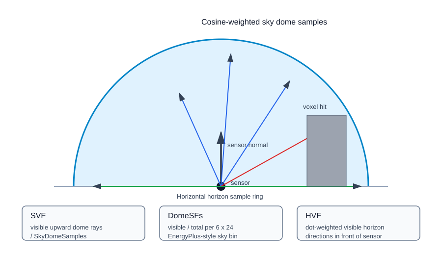

# Sky and Horizon View Factors

This guide explains how the current voxel shading implementation computes sky view factor (SVF), horizon view factor (HVF), and dome sky-bin fractions for diffuse radiation.

## Related API References

- [Python reference: `voxel_shading`](../../python/index.md#voxel_shading)
- [Web reference: controller endpoint inventory](../../web-api/index.md#controller-endpoint-inventory)
- Main endpoint: `POST /api/voxelShading/calculate`
- Main request models: `CalculateShadingRequest`, `VoxelShadingCalcParams`

## Source Implementation

- `EnergyAtlasCore/VoxelShading/SkyViewFactor.cs`
- `EnergyAtlasCore/VoxelShading/HorizonViewFactor.cs`
- `EnergyAtlasCore/VoxelShading/ShadingCalculation.cs`
- `EnergyAtlasLib/Preprocessing/TiledSensorShading.cs`

## Sky View Factor

`SkyViewFactor.ComputeSingleSensorSVF` starts from a `ShadingSensor` with a location, unit normal, and represented area.

1. Generate `SkyDomeSamples` cosine-weighted Hammersley hemisphere directions in a local `+Z` frame.
2. Build an orthonormal basis from the sensor normal and rotate every sample into world space.
3. Skip directions whose world `Z` component is less than or equal to zero.
4. Bin each remaining ray into a 6 x 24 EnergyPlus-style sky matrix:
   - altitude bands: `[0,15)`, `[15,30)`, `[30,45)`, `[45,60)`, `[60,75)`, `[75,90]`
   - azimuth sectors: 24 sectors at 15 degree spacing
5. Ray-march from the sensor location through the voxel grid up to `CalculationRadius`.
6. Count rays with no voxel hit as visible.
7. Return `visibleCount / SkyDomeSamples`.

For a group, `ComputeGroupSVF` averages all sensor SVFs and averages the per-bin `DomeSFs` matrices.

## Horizon View Factor

`HorizonViewFactor.ComputeSingleHVF` uses horizontal directions instead of dome samples.

1. Generate `HorizonSamples` evenly spaced directions around the horizontal plane.
2. If the sensor normal is almost vertical upward, return `0.0`; the roof does not see horizon diffuse in this model.
3. Keep only directions in front of the sensor plane, where `direction dot normal > 0`.
4. Ray-march each kept horizontal direction.
5. Weight visibility by `direction dot normal`.
6. Return `visibleSum / sum`.

For a group, `ComputeGroupHVF` averages all sensor HVFs.

## Parameters

| Parameter | Source field | Effect |
| --- | --- | --- |
| `SkyDomeSamples` | `VoxelShadingCalcParams.SkyDomeSamples` | Number of dome rays per sensor. Default `512`. |
| `HorizonSamples` | `VoxelShadingCalcParams.HorizonSamples` | Number of horizontal rays per sensor. Default `24`. |
| `CalculationRadius` | `VoxelShadingCalcParams.CalculationRadius` | Ray-marching max distance. Default `500`. |
| `CalculateForDiffuse` | `VoxelShadingCalcParams.CalculateForDiffuse` | Enables SVF/HVF/DomeSF calculation. Default `true`. |

## Outputs

| Output | Meaning | Consumer |
| --- | --- | --- |
| `SkyViewFactor` | Group mean sky visibility fraction. | `PerezSky.Diffuse` dome visibility. |
| `HorizonViewFactor` | Group mean horizon visibility fraction. | `PerezSky.Diffuse` horizon visibility. |
| `DomeSFs` | 6 x 24 sky-bin lit fractions. | Stored on `ShadingGroupResult`; not yet used in the simplified incident-radiation path. |

## Notes

- SVF and HVF use the same voxel-grid ray-marching backends as direct sunlit fraction.
- `DomeSFs` bins with no sampled rays default to `0.5`.
- If `CalculateForDiffuse` is false, `ShadingGroupResult` keeps default SVF/HVF values from the result model rather than computing them.
