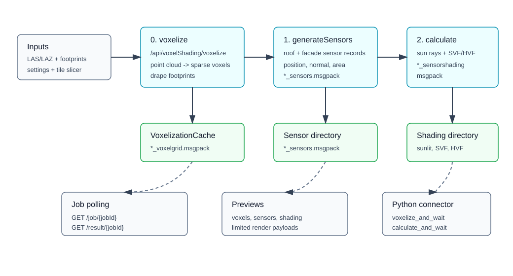

# Voxelization, Sensor Generation, and Shading Pipeline



This guide explains the source-backed workflow exposed by the voxel-shading API and Python connector.

## Related API References

- [Python reference: `voxel_shading`](../../python/index.md#voxel_shading)
- [Web reference: `VoxelShadingController`](../../web-api/index.md#controller-endpoint-inventory)
- Main endpoints:
  - `POST /api/voxelShading/voxelize`
  - `POST /api/voxelShading/generateSensors`
  - `POST /api/voxelShading/calculate`
  - `POST /api/voxelShading/preview/voxels`
  - `POST /api/voxelShading/preview/sensors`
  - `POST /api/voxelShading/preview/shading`
  - `GET /api/voxelShading/job/{jobId}`
  - `GET /api/voxelShading/result/{jobId}`

## Source Implementation

- `EnergyAtlasWeb/Controllers/VoxelShadingController.cs`
- `EnergyAtlasLib/Preprocessing/TiledLidarVoxelization.cs`
- `EnergyAtlasLib/Preprocessing/TiledSensorGeneration.cs`
- `EnergyAtlasLib/Preprocessing/TiledSensorShading.cs`
- `EnergyAtlasCore/VoxelShading/ShadingSensorGen.cs`
- `Connectors/python/src/energyatlas/client.py`
- `Connectors/python/src/energyatlas/models.py`

## Stage 0: LiDAR Voxelization

API: `POST /api/voxelShading/voxelize`

Inputs:

| Request field | Meaning |
| --- | --- |
| `lidarFiles` | One or more `.las` / `.laz` files. |
| `footprintFile` | Footprint GeoJSON path. |
| `outputDir` | Parent output directory; controller writes `VoxelizationCache` inside it. |
| `setting` | `LidarVoxelizationSetting` options. |
| `slicerSetting` | Optional tile slicing options. |

Important options:

| Option | Default | Notes |
| --- | --- | --- |
| `resolution` | `1.0` | Voxel size in meters; validated as `0.25` to `5.0` in the controller. |
| `paddingDistance` | `50` | Tile context buffer for voxelization; validated as `0` to `200`. |
| `kNeighbors` | `4` | Nearest neighbors for mesh draping interpolation. |
| `fillHoleWithMeanEdgeElevation` | `false` | Ground-hole fill mode. |
| `resumeCacheExistsOnly` | `false` | Fast resume mode by cache-file existence. |
| `tileSizeX`, `tileSizeY` | omitted | When both absent/null/nonpositive, native passthrough tiling is used. |

Outputs include per-tile `*_voxelgrid.msgpack` files, footprint summaries, metadata, and a run manifest.

## Stage 1: Shading Sensor Generation

API: `POST /api/voxelShading/generateSensors`

Inputs:

| Request field | Meaning |
| --- | --- |
| `voxelCacheDir` | Directory containing `*_voxelgrid.msgpack` files. |
| `sensorOutDir` | Directory for `*_sensors.msgpack`; required by controller validation. |
| `genOpt` | Sensor-generation options. |
| `resolution` | Voxel resolution used by the worker. |
| `paddingDistance` | Tile context padding for loading voxel context. |

Generation behavior:

- Roof sensors are generated from draped roof mesh non-naked vertices.
- Roof sensor area weights are accumulated from adjacent face areas.
- Roof sensors are offset by `normalOffset` along the vertex normal.
- If `generateOnFacade` is true, facade sensors are generated between roof and ground along simplified footprint segments.
- Facade sensors use `spacing`, `verticalSpacing`, `verticalOffset`, and `facadeNormalOffset`.

Options:

| Option | Default | Effect |
| --- | --- | --- |
| `spacing` | `1.0` | Horizontal sensor spacing. |
| `verticalSpacing` | `1.0` | Facade vertical spacing. |
| `verticalOffset` | `0.5` | Facade vertical start offset. |
| `normalOffset` | `sqrt(2)` | Roof sensor offset from surface. |
| `facadeNormalOffset` | `1.74` | Facade sensor offset from wall plane. |
| `generateOnFacade` | `true` | Include facade sensors in addition to roof sensors. |

Outputs are tile sensor sets with sensor position, normal, area, roof/facade flag, building index, UBID, and surface id.

## Stage 2: Shading Calculation

API: `POST /api/voxelShading/calculate`

Inputs:

| Request field | Meaning |
| --- | --- |
| `voxelCacheDir` | Voxel cache directory. |
| `sensorDir` | Directory containing `*_sensors.msgpack`. |
| `shadingOutDir` | Directory for `*_sensorshading.msgpack`; required by controller validation. |
| `latitude`, `longitude` | Required site coordinates. |
| `calcParams` | Shading calculation options. |
| `resolution` | Voxel resolution. |
| `paddingDistance` | Tile context padding. |

Calculation options:

| Option | Default | Effect |
| --- | --- | --- |
| `calcUpdateFreq` | `20` | Days represented by each representative-day calculation. |
| `timeStep` | `6` | Calculations per hour; must divide 60. |
| `calculationRadius` | `500` | Ray-marching radius for sun/SVF/HVF occluders. |
| `skyDomeSamples` | `512` | Dome rays per sensor for SVF. |
| `horizonSamples` | `24` | Horizontal rays per sensor for HVF. |
| `calculateForDiffuse` | `true` | Compute SVF/HVF for diffuse components. |
| `summarizeHourly` | `true` | Average sub-hour sunlit fractions to hourly output. |
| `timeZone` | omitted | Defaults to `round(longitude / 15)` in the two-stage worker. |

Outputs are tile shading records with sensor metadata plus `SunlitFraction`, `SkyViewFactor`, and `HorizonViewFactor`.

## Preview and Polling

- `preview/voxels` reads voxel cache and returns a limited point payload.
- `preview/sensors` reads sensor files and can include normals.
- `preview/shading` reads shading files and can select a `sunlitIndex`.
- Every long-running stage returns `{ success: true, jobId }`.
- Poll `/api/voxelShading/job/{jobId}` for status.
- Fetch `/api/voxelShading/result/{jobId}` for manifest-like output after completion.

## Python Connector

The connector exposes the same workflow under `client.voxel_shading`:

```python
client.voxel_shading.voxelize_and_wait(...)
client.voxel_shading.generate_sensors_and_wait(...)
client.voxel_shading.calculate_and_wait(...)
```

It also exposes direct `voxelize`, `generate_sensors`, `calculate`, preview, job, and result calls for custom polling.
